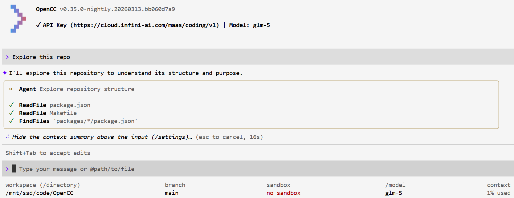

# OpenCC

Disclaimer: This README document is a human-created document, and you may trust its contents.

## What's this

This is a Gemini CLI fork designed to align with the Claude Code tool design, aiming to be a fully open-source, cleanroom reverse engineering version of Claude Code.

## Advantages

- (Expected) Powerful Agent capabilities perfectly aligned with Claude code
- Tested and used by humans, rather than a bug-ridden AI slop
- Open source, no leaked source code used
- Compatible with OpenAI chat/completions API, no external converter required
- No telemetry
- (Perhaps) a more aesthetically pleasing TUI than the original Claude Code

## Quickstart

### Manual

Download from [releases](https://github.com/lyc8503/OpenCC/releases), untar it, put the standalone executable `opencc` in your PATH.

### One-line script (for Linux)

`curl | bash` is bad practice. Let's see what we run:

```
mkdir -p ~/.local/bin/ && wget -O /tmp/opencc.tar.gz https://github.com/lyc8503/OpenCC/releases/download/v0.1.0/opencc-cli-linux-x64.tar.gz && tar zxvf /tmp/opencc.tar.gz -C /tmp/ && mv /tmp/linux-x64/opencc ~/.local/bin/ && chmod 755 ~/.local/bin/opencc && rm -rf /tmp/linux-x64 /tmp/opencc.tar.gz && echo "OpenCC Installed. Make sure ~/.local/bin is in your PATH and run opencc to get started."
```

After installation, run `opencc` and use `/model` to specify a OpenAI-compatible endpoint to start using it.

Use `Ctrl+Y` to enable YOLO mode (skip tool confirmation).

## Some screenshots



## TODOs

Status: The project is now basically operational and has implemented most of the tools in Claude Code; bugs still exist, and I will continue to fix and improve it. Feel free to report any bugs you encounter in the issues.

- [ ] dynamic prompt / reminder
- [ ] Better Plan mode prompt
- [ ] Better worktree handling
- [ ] WebSearch
- [ ] WorkTree tools
- [ ] Automated test to ensure consistent behaviour
